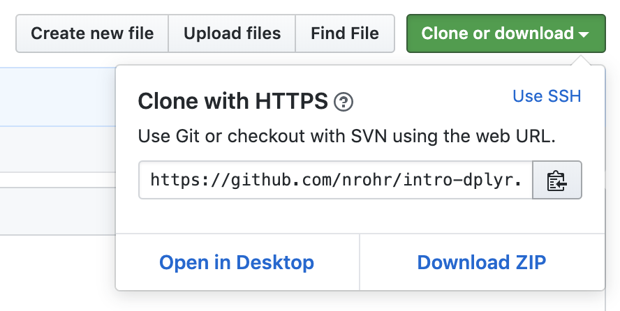
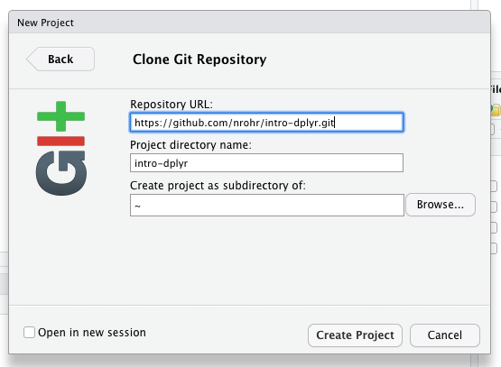

# Data Manipulation with `dplyr`

This repository contains materials introducing the [`dplyr`](https://dplyr.tidyverse.org/) package for manipulating data in R.

To clone this repository to your computer, click the green "Clone or download" button in the upper right of this page, then copy the URL:



Then in RStudio, create a New Project > Version Control > Git and enter the URL:



You'll also want to install the `dplyr` package before running any of the code in this repository:

```
install.packages("dplyr")

# Or, to get the whole tidyverse:
install.packages("tidyverse")
```


Contents

* __intro-dplyr.Rmd__: R Notebook containing webinar code
* __credit_data.csv__: our dataset


Other resources for learning data manipulation in R

* [dplyr.tidyverse.org](https://dplyr.tidyverse.org)
* [R for Data Science](http://r4ds.had.co.nz) - free online book
* [The Grammar and Graphics of Data Science](https://resources.rstudio.com/the-essentials-of-data-science/the-grammar-and-graphics-of-data-science-58-51) - webinar, 58:50
* [Data Wrangling with R and RStudio](https://resources.rstudio.com/the-essentials-of-data-science/data-wrangling-with-r-and-rstudio-55-40) - webinar, 55:39
* [Data Transformation with dplyr](https://resources.rstudio.com/the-essentials-of-data-science/data-transformation) - cheatsheet
* [Business Analysis with R](https://university.business-science.io/p/ds4b-101-r-business-analysis-r) - paid online course
* [RStudio Community](https://community.rstudio.com) - discussion forum